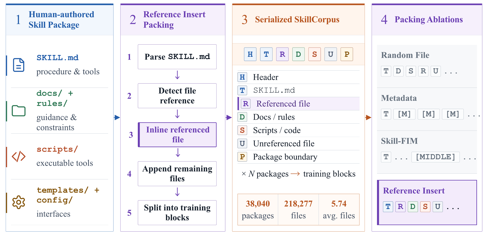
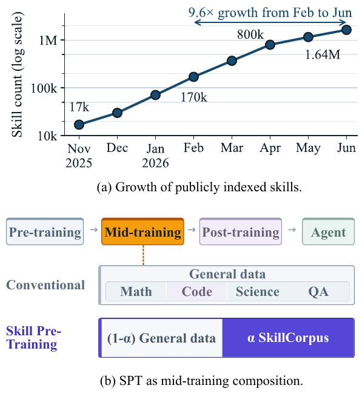
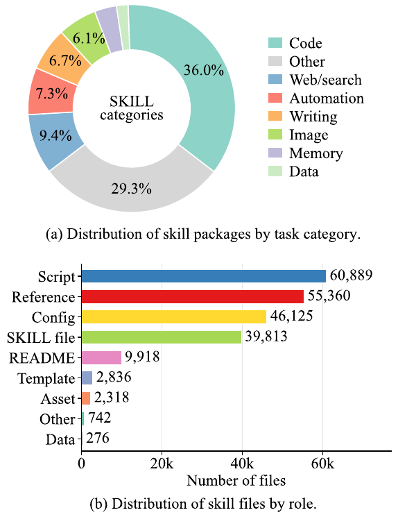
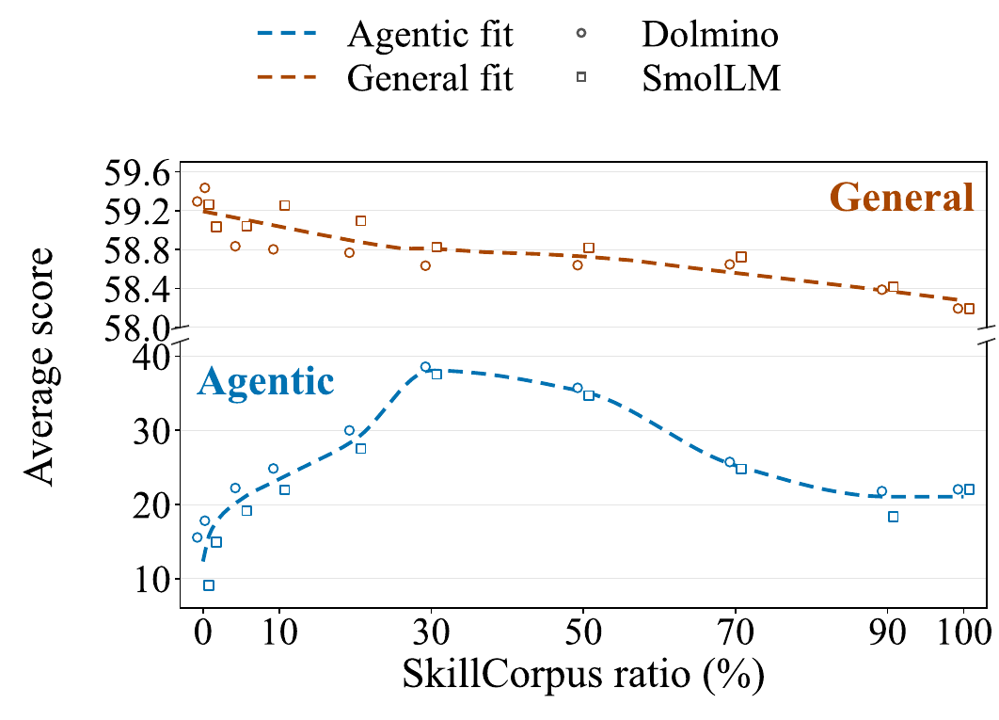

# SPT: Skills as Pre-Training Data for Agentic Language Models

<p align="center">
  <a href="https://arxiv.org/abs/2608.26563">Paper</a> |
  <a href="https://huggingface.co/datasets/CSeemy/SkillCorpus">Dataset</a>
</p>

SPT is a mid-training method that uses human-written, multi-file skill packages as language-modeling data before behavior-oriented post-training. It introduces **Reference Insert**, which places supporting files near their first mention in the primary skill instruction while preserving package boundaries.



## SkillCorpus

The public SkillCorpus v3 release contains 35,411 JSONL records. We use seed `42` and a deterministic 7:2:1 split:

| Split | Records |
| --- | ---: |
| Train | 24,788 |
| Validation | 7,082 |
| Test | 3,541 |

Load the dataset directly from the Hugging Face Hub:

```python
from datasets import load_dataset

dataset = load_dataset("CSeemy/SkillCorpus")
```

Each record contains the serialized skill text together with package identifiers, source metadata, size statistics, and filtering metadata. The complete field set is documented in the dataset card.

Skill packages are untrusted data. Inspect their contents before use, and do not execute included instructions or scripts automatically. Source-package terms and licenses continue to apply.

## Paper figures

### Public skill growth and the SPT training stage



### SkillCorpus composition



### Skill/general-data mixture trade-off



## Citation

```bibtex
@article{sun2026spt,
  title   = {SPT: Skills as Pre-Training Data for Agentic Language Models},
  author  = {Sun, Yufei and Li, Yudong and Cheng, Yiming},
  journal = {arXiv preprint arXiv:2608.26563},
  year    = {2026}
}
```
